# Creepy Crawly Pest Control — Comprehensive Website & Business Research
**Target Benchmark Website:** [https://www.creepycrawly.com.au/](https://www.creepycrawly.com.au/)  
**Document Purpose:** Detailed architectural, service, marketing, and technical research for building a modern, high-converting pest control website.

---

## 1. Executive Summary & Brand Profile

| Attribute | Creepy Crawly Pest Control Benchmark | Modern Industry Standard / Best Practice |
| :--- | :--- | :--- |
| **Years in Business** | 40+ Years (Established heritage) | Emphasize stability, proven track record, longevity |
| **Ownership** | 100% Australian Family Owned | Community trust, local accountability |
| **Leadership / Credibility** | CEO Anthony Anderson (University Graduate in Pest Management) | Academic entomology & technical pest science backing |
| **Accreditations** | QBCC License #655077, Cert CCP30911 (Units 8 & 10) | State license badges, insurance coverage, master pest control certificates |
| **Proven Track Record** | 200,000+ residential homes & 15,000+ commercial buildings protected | Concrete statistical proof points to eliminate friction |
| **Core Value Proposition** | "Safe Home" treatments — safe for children & pets, eco-sensible, rapid 24hr response | Eco-friendly chemistry, pet-safe, transparent pricing, 100% money-back guarantee |

---

## 2. Complete Information Architecture (Sitemap)

```mermaid
graph TD
    Home["Home Page"] --> PC["Residential Pest Control"]
    Home --> TC["Termite Solutions"]
    Home --> COMM["Commercial & Industrial"]
    Home --> BLD["Builders & Pre-Construction"]
    Home --> HB["Home Buyers Inspections"]
    Home --> ABOUT["About Us & Guarantees"]
    Home --> AREAS["Service Areas / Locations"]
    Home --> CONTACT["Contact & Quote Booking"]

    PC --> P1["Ants & Fire Ants"]
    PC --> P2["Cockroaches"]
    PC --> P3["Spiders"]
    PC --> P4["Rodents (Rats & Mice)"]
    PC --> P5["Fleas & Ticks"]
    PC --> P6["Bed Bugs"]
    PC --> P7["Control vs Prevention"]

    TC --> T1["Timber Pest Inspections"]
    TC --> T2["Termidor Chemical Barriers"]
    TC --> T3["Sentricon Baiting Systems"]
    TC --> T4["Plasmite Reticulation"]

    COMM --> C1["Healthcare & Aged Care"]
    COMM --> C2["Hospitality & Restaurants"]
    COMM --> C3["Property Management / Strata"]
    COMM --> C4["Retail & Warehousing"]
    COMM --> C5["Sterimist Disinfection"]

    BLD --> B1["Frame Protection (Plasmite)"]
    BLD --> B2["Tubes in the Wall System"]
    BLD --> B3["Termifilm Barrier"]
    BLD --> B4["Stainless Steel Woven Mesh"]
    BLD --> B5["TAP Pest Insulation"]
```

---

## 3. In-Depth Service Breakdown & Technology Stack

### 3.1 Residential Pest Control
* **Target Audience:** Homeowners, tenants, landlords, pet owners.
* **Key Pests Treated:**
  * **Cockroaches:** German cockroaches (kitchen infestations), American & Australian cockroaches (drains, wall cavities, roofs). Gel baits, perimeter micro-encapsulated sprays.
  * **Ants & Invasive Fire Ants:** Colony bait transfer mechanisms (fipronil/indoxacarb) targeting nests rather than surface eradication only.
  * **Spiders:** Redbacks, White-tails, Funnel-webs, Huntsman, Black house spiders. Roof void dusting, external weep-hole treatment, foliage barrier.
  * **Rodents (Rats & Mice):** Tamper-resistant exterior bait stations, interior trap line deployment, structural entry point identification.
  * **Fleas:** Growth regulators (IGR) + adulticides for end-of-lease clearing and heavy domestic infestations.
  * **Bed Bugs:** Heat treatments, residual perimeter dusting, mattress encasement integration.
* **Safety Protocol:** "Safe Home" pledge using synthetic pyrethroids and insect growth regulators that bind to surfaces once dry, leaving no airborne toxins for pets or infants.

### 3.2 Termite Control & Timber Pest Management (Highest ROI Tier)
* **Inspection Methodology:**
  * Compliance with Australian Standards **AS 3660.2** and **AS 4349.3**.
  * Detection hardware:
    * **Termatrac T3i:** Microwave radar movement detection behind plasterboard without drilling.
    * **Thermal Imaging Infrared Cameras:** Heat differential mapping indicating colony moisture pockets.
    * **Moisture Meters:** Tramex/Protimeter electronic moisture measurement.
    * **Acoustic Sounding Rods:** Tapping structural timbers for internal hollow cavities.
* **Treatment Systems:**
  * **Termidor Liquid Soil Treatment:** Non-repellent chemical barrier creating a lethal transfer zone back to the central nest.
  * **Sentricon AlwaysActive Baiting System:** In-ground bait stations equipped with Hexaflumuron rods that prevent chitin synthesis.
  * **Plasmite™ Reticulation System:** Perforated underground conduit lines around foundations allowing chemical replenishment every 3–5 years without trenching.
  * **Termifilm™:** Polyethylene barrier impregnated with termiticide for wet areas, sub-slab, and perimeter footing.

### 3.3 Builders & Pre-Construction Systems (B2B Commercial Stream)
* **Target Audience:** Residential home builders, civil contractors, structural engineers.
* **Key Solutions:**
  * **Plasmite Frame Protection:** Direct timber framing penetration spray against drywood and subterranean wood boring pests.
  * **Plasmite Tubes in the Wall™:** Internal service cavity piping network for re-treatment without drilling internal drywall.
  * **Marine-Grade 316 Stainless Steel Woven Mesh:** Physical exclusion barrier impenetrable to termites, resistant to soil corrosion.
  * **TAP Pest Insulation:** Blown-in thermal and acoustic cellulose insulation treated with boric acid to deter silverfish, roaches, and termites in roof spaces.
  * **Compliance Handover:** Form 16 / QBCC certification required for certificate of occupancy.

### 3.4 Commercial Pest Management & Sterimist Disinfection
* **Target Audience:** Commercial kitchens, restaurants, food processing plants, healthcare clinics, hotels, real estate strata managers.
* **Offerings:**
  * Scheduled preventative maintenance contracts (monthly, quarterly, biannual).
  * Food safety audit documentation (HACCP logbooks, bait station mapping, trend reporting).
  * **Sterimist Application:** Ultra-low volume (ULV) cold misting/fogging of hospital-grade disinfectant for infection control.

---

## 4. Sales Psychology, Conversion Triggers & Trust Architecture

Creepy Crawly uses several effective conversion mechanics that should be replicated and polished:

1. **Lead Generation Voucher Hook:**
   * Headline: *"Eligible new customers receive a $50.00 discount voucher"*.
   * Applicable services: Termite inspection, full pest treatment, senior citizen concession.
   * Requirement: Pre-payment / immediate booking confirmation.
2. **Ironclad Guarantees:**
   * **Money-Back Guarantee:** If pests return within the warranty period, free re-treatment; if still unsatisfied, 100% refund of the last payment.
   * **24-Hour Rapid Response Pledge:** Emergency technician dispatch promise.
3. **Friction-Free Direct Contact Points:**
   * Prominent **1800 Freecall** hotline visible across top header bar.
   * Quick Quote Request form modal accessible from every section.
   * Region-specific phone numbers for direct local dispatch (e.g., Toowoomba, Sunshine Coast, Rockhampton, Sydney).
4. **Convenience & Financial Flexibility:**
   * **Interest-Free Payment Terms:** Buy Now, Pay Later or installment financing for large-scale termite treatment installations ($2,000–$5,000+).
   * **Online Invoice Pay Gateway:** Dedicated customer payment link (Credit card / PayPal) for accounts and real estate property managers.
   * **Warranty Registration Portal:** Web form for new home buyers to register builder-installed termite management warranties.
5. **Cause Marketing & Social Responsibility:**
   * Partnership with *"Nothing But Nets"* (UN Foundation malaria eradication program providing insecticide-treated bed nets). Demonstrates global pest awareness and social ethics.

---

## 5. Geographic Strategy & Multi-Location Structure

Creepy Crawly operates across multiple hubs in Queensland and New South Wales:

| Region | Physical Hub / Suburb | Target Audience Focus |
| :--- | :--- | :--- |
| **Toowoomba (HQ)** | 41 Wilkinson St, Harlaxton QLD 4350 | Core residential, commercial, agricultural fringe |
| **Brisbane & Gold Coast** | 10 Quindus St, Beenleigh QLD 4207 | Subtropical pests, high-density residential & strata |
| **Sunshine Coast / North Brisbane** | Unit 2/10 Endeavour Dr, Kunda Park QLD 4566 | Coastal termite pressure, holiday hospitality |
| **Darling Downs & Western QLD** | Warwick, Esk, Kingaroy | Rural pests, timber protection, franchises |
| **Central Queensland** | 114 Elphinstone St, Berserker (Rockhampton / Gladstone) | Tropical ants, aggressive termite zones |
| **Sydney Metro / Western Suburbs** | Glenmore Park / Bondi NSW | Urban apartments, rodent control, pre-purchase checks |

**Strategy Takeaway for New Website:**
Implement **Programmatic Local Landing Pages** (e.g. `/locations/toowoomba-pest-control`, `/locations/brisbane-termite-inspection`) containing customized local address details, local customer reviews, maps, and local phone numbers to rank high in Local Google Map Pack and organic SEO.

---

## 6. Audit of Flaws & Modernization Opportunities (How to Outperform the Benchmark)

While Creepy Crawly has strong brand authority and heritage, its current website has several technical and UX shortcomings:

| Area | Creepy Crawly Weakness | Our Modern Website Improvement |
| :--- | :--- | :--- |
| **UI Aesthetics** | Outdated TYPO3 table/box layout, low-res graphics, text clutter. | Sleek modern aesthetics: glassmorphism, clean typography (Inter / Outfit), crisp SVG icons, polished pest imagery. |
| **User Experience (UX)** | Clunky menu hierarchy with duplicate links; broken links (e.g. `/request-a-quote` returning 404). | Sticky mobile action bar (`Call Now`, `Get Instant Quote`, `Book Online`), intuitive tabbed pest selector, zero 404s. |
| **Online Estimation** | No real-time estimate calculator; relies only on static contact forms. | **Interactive Pricing Calculator:** Users select bedrooms, property type, pest type -> see instant estimate with voucher applied. |
| **Booking & Scheduling** | Manual phone call or email ping-pong. | Integrated interactive booking calendar with time-slot selection. |
| **Trust Demonstration** | Text-heavy testimonial lists without photos, video, or verified badges. | Google Reviews badge widget (e.g., 4.9★ rating with 450+ verified reviews), before/after video clips, interactive termite camera demo. |
| **Pest Identification** | Basic bulleted lists. | **Interactive Pest Identifier Tool:** Upload a photo or select symptoms (droppings, bites, wood shavings) -> get instant pest diagnosis. |
| **Mobile Responsiveness** | Heavy desktop-centric navigation drawer with multiple redundant sub-links. | Mobile-first touch-friendly design, 1-click tap to call, auto-filled location detection via ZIP/postcode. |

---

## 7. Recommended Technical Architecture & Feature Roadmap

### 7.1 Tech Stack Recommendation
* **Frontend:** Semantic HTML5, Vanilla Modern CSS with CSS custom properties (variables), Vanilla JavaScript (lightweight, blazing-fast, 99+ Core Web Vitals score).
* **Color Palette:**
  * Primary: `#0F3A2E` (Deep Forest Eco-Green — communicates safety, trust, nature)
  * Secondary: `#1E293B` (Slate Navy — authority and professionalism)
  * Accent / CTA: `#FFB800` / `#FF7A00` (Safety Gold / Warning Amber — high-visibility urgency)
  * Surface / Background: `#F8FAFC` (Clean sterile light gray/white) and `#0B131E` (Dark mode contrast)
* **Typography:**
  * Headings: `Plus Jakarta Sans` or `Outfit` (Modern, bold, authoritative)
  * Body: `Inter` (Legible, clean, optimized for mobile screens)

### 7.2 Core Pages & Modules to Build
1. **Header & Navigation:**
   * Emergency / same-day dispatch alert ribbon.
   * Freecall 1800 number + $50 Voucher CTA button.
   * Mega-menu organizing services cleanly into Residential, Termite, Commercial, and Pre-Construction.
2. **Hero Section:**
   * High-impact headline: *"Guaranteed Protection For Your Home, Family & Pets"*.
   * Instant Suburb / Postcode service availability checker.
   * Trust badges: 40+ Years, QBCC Licensed, 100% Money-Back Guarantee, 5-Star Reviews.
3. **Pest Control Interactive Grid:**
   * Interactive cards for Cockroaches, Ants, Termites, Spiders, Rodents, Fleas, Bed Bugs with symptoms, risks, and treatment times.
4. **Termite Defense Technology Showcase:**
   * Visual comparison of Termidor vs Sentricon vs Plasmite Reticulation with animated diagram of protective soil barrier.
   * Breakdown of Termatrac radar and thermal camera inspection process.
5. **Instant Pricing & Quote Calculator:**
   * 3-step interactive widget:
     1. Select property type (Apartment / House / Commercial)
     2. Select pest issue (General pest combo, Termite inspection, Specific pest)
     3. Select speed (Standard / Emergency same-day)
     4. Dynamic price range + "$50 New Customer Voucher automatically applied".
6. **Commercial / Builder B2B Portal Section:**
   * Highlights Form 16 certification, HACCP documentation, industrial warranties.
7. **Customer Assurance & Guarantee Showcase:**
   * 100% Money-Back Guarantee badge.
   * 24-Hour technician re-service promise.
   * Pet & Child friendly chemical certification icon.
8. **Locations & Service Radius Map:**
   * Interactive accordion / tabs for each servicing region with local contact details.
9. **Footer with Utility Hub:**
   * Warranty registration form link.
   * Online payment link.
   * Client portal login.
   * Full SEO sitemap and licensing notices (QBCC #655077).

---

## 8. Summary Checklist for Website Execution

- [x] Analyze benchmark domain structure, branding, and copywriting.
- [x] Document complete list of services, termite systems, and pre-construction products.
- [x] Document key promotional hooks ($50 voucher, interest-free payment, senior discounts).
- [x] Map out information architecture and SEO local pages.
- [x] Identify competitive gaps and conversion improvements.
- [ ] Implement responsive, high-aesthetic web interface following modern UI/UX design standards.
